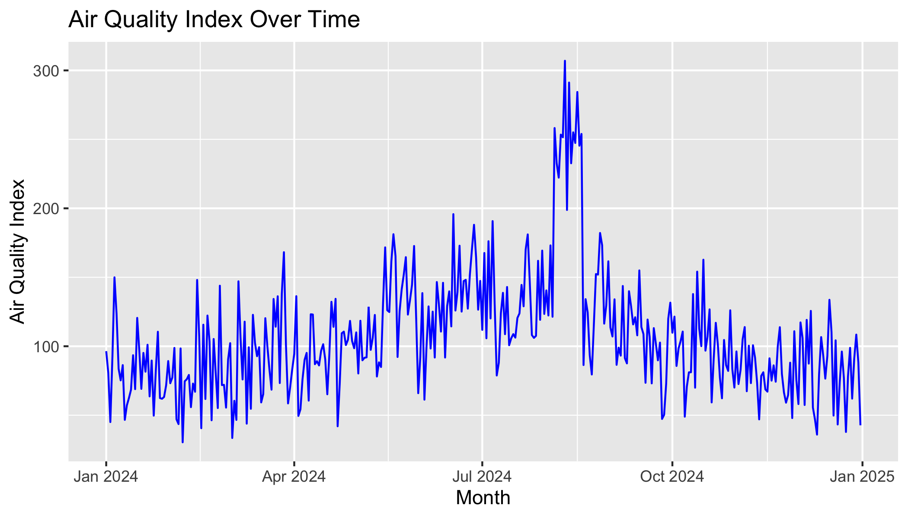
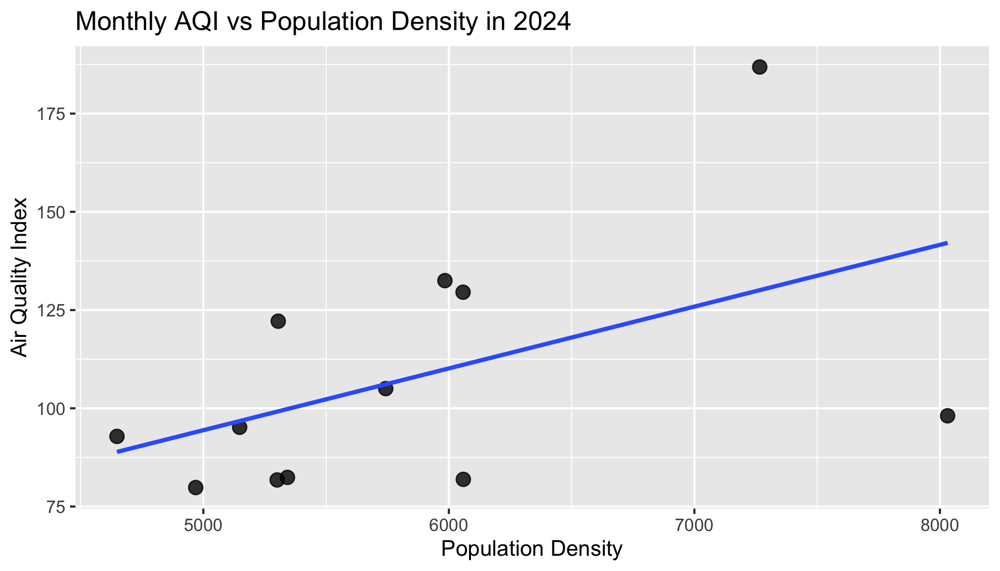
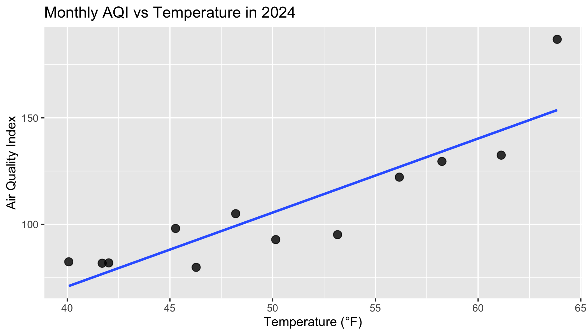
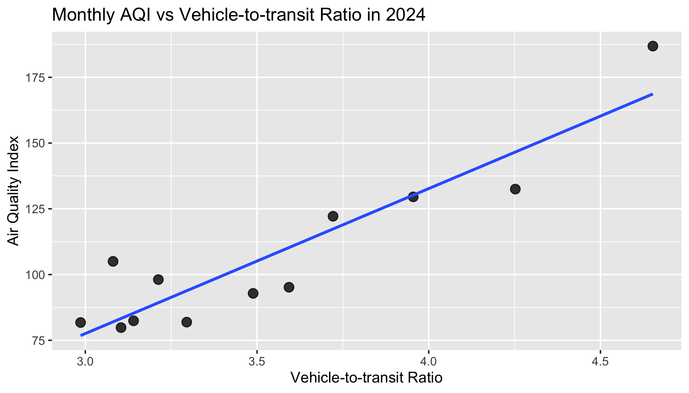

Group Project 1
================
2025-09-18

1.  Air Quality Trend Over Time? Figure 1 presents daily AQI conditions
    from 2024 into early 2025 and frames the context for subsequent
    analysis. AQI generally ranges from 70–150 (Moderate to Unhealthy
    for Sensitive Groups), with a seasonal build from late winter into
    summer. A brief but severe mid-August excursion above 300 (Very
    Unhealthy/Hazardous) appears episodic rather than indicative of a
    new baseline; levels normalize rapidly and remain comparable through
    autumn and into early 2025. Overall, the series reflects seasonal
    and event-driven variability without evidence of a persistent upward
    trend over the period.

<!-- -->

2.  Population Density? Figure 2 shows a weak positive relationship
    between monthly mean population density and AQI. While the
    regression line slopes upward, the points are widely dispersed, and
    a high-AQI/high-density observation appears influential. Taken
    together, the evidence suggests at most a weak-to-moderate
    association. These cross-sectional monthly summaries do not imply
    causality and may reflect unobserved factors such as meteorology or
    episodic smoke.

<!-- -->

3.  Temperature? Figure 3 summarizes the association between monthly
    mean temperature and the AQI. The fitted linear trend is upward,
    indicating that warmer months are associated with higher AQI,
    consistent with temperature-driven secondary pollutant formation.
    Dispersion around the fit is substantial, so the relationship
    appears moderate rather than strong. Results should be interpreted
    cautiously given the small monthly sample and potential seasonal
    confounding.

<!-- -->

4.  Vehicle-to-transit Ratio? Figure 4 demonstrates the association
    between the vehicle-to-transit ratio and monthly air quality. The
    fitted linear trend is upward-sloping, indicating that months with
    greater car reliance tend to register higher AQI levels. However,
    dispersion around the fit and the presence of a high-ratio/high-AQI
    observation suggest a moderate relationship that may be sensitive to
    influential points. This pattern aligns with expectations about
    on-road emissions but is not causal; concurrent factors such as
    temperature, seasonal photochemistry, and episodic smoke may
    confound the association.

<!-- -->

5.  Median Income? Figure 5 indicates a slight positive association
    between median income and monthly AQI in 2024: the fitted line tilts
    upward, but the point cloud is diffuse. One or two high-income
    months with elevated AQI appear influential, so the slope is likely
    sensitive to those observations. Given the small N and monthly
    aggregation, this result should be treated as descriptive rather
    than causal.

<!-- -->

6.  New Housing Supply? Figure 6 plots monthly AQI against new housing
    supply and shows an upward-sloping fitted line, indicating higher
    AQI in months with more starts. The dispersion around the fit is
    wide, and a high-supply/high-AQI observation appears influential, so
    the association is at most moderate and potentially leverage-driven.
    Because housing starts co-vary with season and macro conditions, and
    AQI is sensitive to meteorology and episodic smoke, this
    relationship should be interpreted as descriptive rather than causal
    as well.

<!-- -->

7.  Conclusion? Cross-plots show that warmer months are associated with
    higher AQI, consistent with temperature-driven secondary pollutant
    formation, while indicators of travel mix (higher vehicle-to-transit
    ratios) also track higher AQI. By contrast, population density,
    median income, and new housing starts exhibit only weak,
    leverage-sensitive associations, suggesting they are not primary
    drivers of the intra-year pattern. Taken together, the story is one
    of seasonal accumulation and occasional shocks, not a steady
    deterioration: AQI rises with heat and specific episodes, then
    settles back toward typical levels in the fall. Future work should
    formalize this with multivariable models that control for
    meteorology and seasonality and include event indicators, to
    separate persistent trends from transitory spikes.
